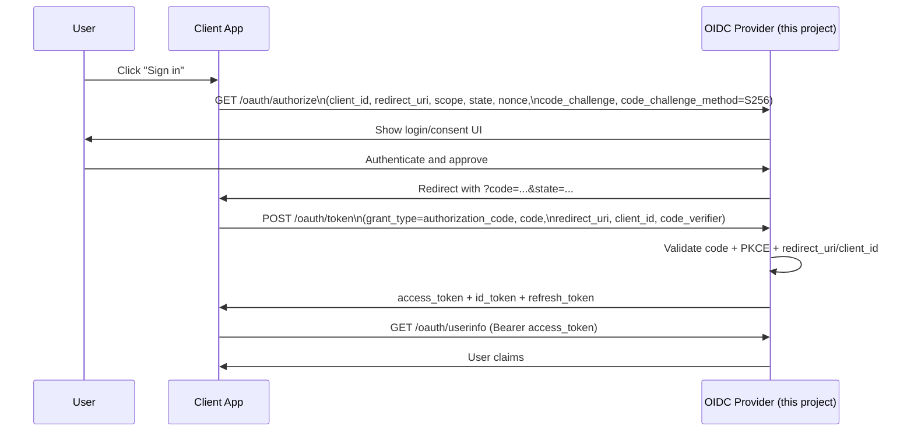

# OIDC Identity Provider (IdP) - Learning Project

A from-scratch OpenID Connect provider that demonstrates how OAuth 2.0 Authorization Code Flow, PKCE, nonce handling, discovery, JWKS, and token issuance work on the server side.

## Table Of Contents

- [Introduction](#introduction)
- [Tech Stack](#tech-stack)
- [Project Structure](#project-structure)
- [Project Setup / Getting Started](#project-setup--getting-started)
- [OAuth 2.0 vs OIDC](#oauth-20-vs-oidc)
- [Nonce and PKCE Explained](#nonce-and-pkce-explained)
- [OIDC Authorization Code Flow](#oidc-authorization-code-flow)
- [BFF Demo Flow](#bff-demo-flow)
- [Discovery Endpoint](#discovery-endpoint)
- [Token Shapes](#token-shapes)
- [API Endpoints and Their Use](#api-endpoints-and-their-use)
- [Educational Limits Of This Project](#educational-limits-of-this-project)
- [Future Improvements](#future-improvements)
- [References](#references)

## Introduction

This repository is built for education and experimentation. It helps you understand identity flows by implementing core OIDC provider responsibilities directly in Node.js.

What this project demonstrates:
- OIDC Authorization Code Flow with PKCE (`S256`)
- OIDC discovery and JWKS publication
- Access token, ID token, and refresh token issuance
- Userinfo endpoint behavior
- Public client registration and token exchange
- A browser-friendly BFF flow under normal app routes (`/login`, `/me`, `/logout`, etc.)

This is not production authentication infrastructure. It is a practical learning sandbox.

## Tech Stack

| Layer | Choice |
| --- | --- |
| Runtime | Node.js |
| Language | JavaScript (ES modules) |
| Framework | Express |
| ORM | Drizzle ORM |
| Database | PostgreSQL |
| JWT signing | `jsonwebtoken` |
| JWK / JWKS | `node-jose` |
| Password hashing | `bcrypt` |
| Validation | Zod |
| Uploads | Multer |
| Image hosting | ImageKit |

## Project Structure

```text
src/
  app.js                    # Express app wiring
  common/
    config/                 # Environment and config handling
    db/                     # Drizzle schema and DB access
    middleware/             # Shared middleware
    utils/                  # Shared helper utilities
  module/
    oauth/                  # OIDC/OAuth endpoints, services, middleware
    web/                    # BFF login/session flow
    client/                 # OAuth client registration/read APIs
    account/                # User account registration
    auth/                   # User sign-in
public/                     # Demo HTML pages
drizzle/                    # Migration artifacts
index.js                    # Server entrypoint
README.md
```

## Project Setup / Getting Started

```bash
pnpm install
./key-gen.sh
cp .env.example .env
pnpm db:generate
pnpm db:migrate
pnpm dev
```

Default local URL:

```text
http://localhost:3000
```

Use `.env.example` as the environment variable reference.

## OAuth 2.0 vs OIDC

- **OAuth 2.0** is for authorization: "Can this app access this resource?"
- **OIDC** adds authentication identity on top of OAuth 2.0: "Who is the user?"

In practice:
- OAuth gives you an `access_token` to call APIs.
- OIDC adds an `id_token` with identity claims (`sub`, `email`, etc.) and standard discovery metadata.

## Nonce and PKCE Explained

### Nonce (OIDC replay protection for ID tokens)

`nonce` is generated by the client and sent in `/oauth/authorize`. The provider stores it with the authorization code and later includes it in the issued ID token.

Why it matters:
- Prevents replay/substitution of ID tokens
- Lets the client verify the ID token belongs to the original auth request

### PKCE (OAuth code interception protection)

PKCE uses a one-time verifier/challenge pair:
1. Client creates a random `code_verifier`
2. Client sends `code_challenge = BASE64URL(SHA256(code_verifier))` in `/oauth/authorize`
3. Provider stores `code_challenge`
4. Client sends original `code_verifier` to `/oauth/token`
5. Provider recalculates and compares

If they do not match, token exchange fails (`invalid_grant`).

## OIDC Authorization Code Flow



In words:
- The browser is redirected to `/oauth/authorize` with `state`, `nonce`, and PKCE values.
- After login/consent, the provider returns a short-lived authorization code.
- The client backend exchanges the code at `/oauth/token` using the PKCE verifier.
- The provider issues tokens and the client can call `/oauth/userinfo`.

## Backend For Frontend Demo Flow


In words:
- Tokens stay server-side, not in browser JavaScript.
- Browser receives only a session cookie.
- This mirrors common production BFF patterns at a simplified level.

## Discovery Endpoint

The OIDC discovery metadata is available at:

- `GET /.well-known/openid-configuration`

JWKS is available at:

- `GET /.well-known/jwks.json`

Current discovery shape:

```json
{
  "issuer": "http://localhost:3000",
  "authorization_endpoint": "http://localhost:3000/oauth/authorize",
  "token_endpoint": "http://localhost:3000/oauth/token",
  "userinfo_endpoint": "http://localhost:3000/oauth/userinfo",
  "jwks_uri": "http://localhost:3000/.well-known/jwks.json",
  "response_types_supported": ["code"],
  "subject_types_supported": ["public"],
  "id_token_signing_alg_values_supported": ["RS256"],
  "scopes_supported": ["openid", "profile", "email", "offline_access"],
  "token_endpoint_auth_methods_supported": ["none"],
  "grant_types_supported": ["authorization_code", "refresh_token"],
  "code_challenge_methods_supported": ["S256"]
}
```

## Token Shapes

### Access Token (JWT)

Used to call protected resource endpoints such as `/oauth/userinfo`.

```json
{
  "sub": "user-uuid",
  "scope": "openid profile email offline_access",
  "token_use": "access_token",
  "iss": "http://localhost:3000",
  "aud": "userinfo",
  "iat": 1710000000,
  "exp": 1710003600
}
```

### ID Token (JWT)

Used by clients to authenticate the user and validate claims, including `nonce`.

```json
{
  "sub": "user-uuid",
  "aud": "oidc-web-client",
  "email": "user@example.com",
  "email_verified": true,
  "name": "Jane Doe",
  "given_name": "Jane",
  "family_name": "Doe",
  "picture": "https://example.com/avatar.png",
  "token_use": "id_token",
  "auth_time": 1710000000,
  "nonce": "nonce-from-authorize-request",
  "at_hash": "hash-of-access-token",
  "iss": "http://localhost:3000",
  "iat": 1710000000,
  "exp": 1710003600
}
```

### Refresh Token (Opaque string)

Used to request new access/ID tokens without re-authenticating.

```json
{
  "refresh_token": "opaque-random-base64url-string"
}
```

## API Endpoints and Their Use

### Discovery
- `GET /.well-known/openid-configuration` - Provider metadata for OIDC clients.
- `GET /.well-known/jwks.json` - Public signing keys for JWT verification.

### OAuth/OIDC
- `GET /oauth/authorize` - Starts Authorization Code flow.
- `POST /oauth/token` - Exchanges code or refresh token for new tokens.
- `GET /oauth/userinfo` - Returns user claims for a valid access token.

### User Account and Auth
- `POST /accounts/register` - Creates a local user account.
- `POST /auth/sign-in` - Signs in user credentials for the auth UI flow.

### Client Management
- `GET /clients` - Lists registered clients.
- `GET /clients/:clientId` - Returns one client's public details.
- `POST /clients/register` - Registers a new OAuth client.

### Web/BFF Demo
- `GET /login/start` - Creates flow state and redirects to authorization.
- `GET /login` - Login page for web demo.
- `GET /signin` - Alias for `/login`.
- `GET /signup` - Signup page for web demo.
- `GET /login/callback` - Handles auth callback and token exchange.
- `GET /dashboard` - Demo dashboard.
- `GET /me` - Returns current web session profile.
- `GET /apps` - Returns apps for current session.
- `POST /refresh` - Refreshes session token set.
- `POST /logout` - Ends web session.

## Educational Limits Of This Project

This project is intentionally scoped for learning, not production.   I have made an effort to read the documentation and implement this, the tough part for me was to figure out to keep everything at backend and have no token transaction on frontend. This project was a way to gain understaning of the provider end of IdP. 

## Future Improvements

- Add confidential client auth (`client_secret_*`) support
- Hash refresh tokens at rest and implement token family/reuse detection
- Preserve authorization code audit data (`usedAt`, `revokedAt`, IP/device metadata)
- Add endpoint rate limiting and stronger brute-force protection
- Add structured security logging and observability dashboards
- Add key rotation with multiple active JWKs and overlap windows
- Add stronger session CSRF protections and centralized cookie policy

## References

- [OpenID Connect Core 1.0](https://openid.net/specs/openid-connect-core-1_0.html)
- [OpenID Connect Discovery 1.0](https://openid.net/specs/openid-connect-discovery-1_0.html)
- [OAuth 2.0 RFC 6749](https://datatracker.ietf.org/doc/html/rfc6749)
- [PKCE RFC 7636](https://datatracker.ietf.org/doc/html/rfc7636)
- [JWT RFC 7519](https://datatracker.ietf.org/doc/html/rfc7519)
- [JWK RFC 7517](https://datatracker.ietf.org/doc/html/rfc7517)
